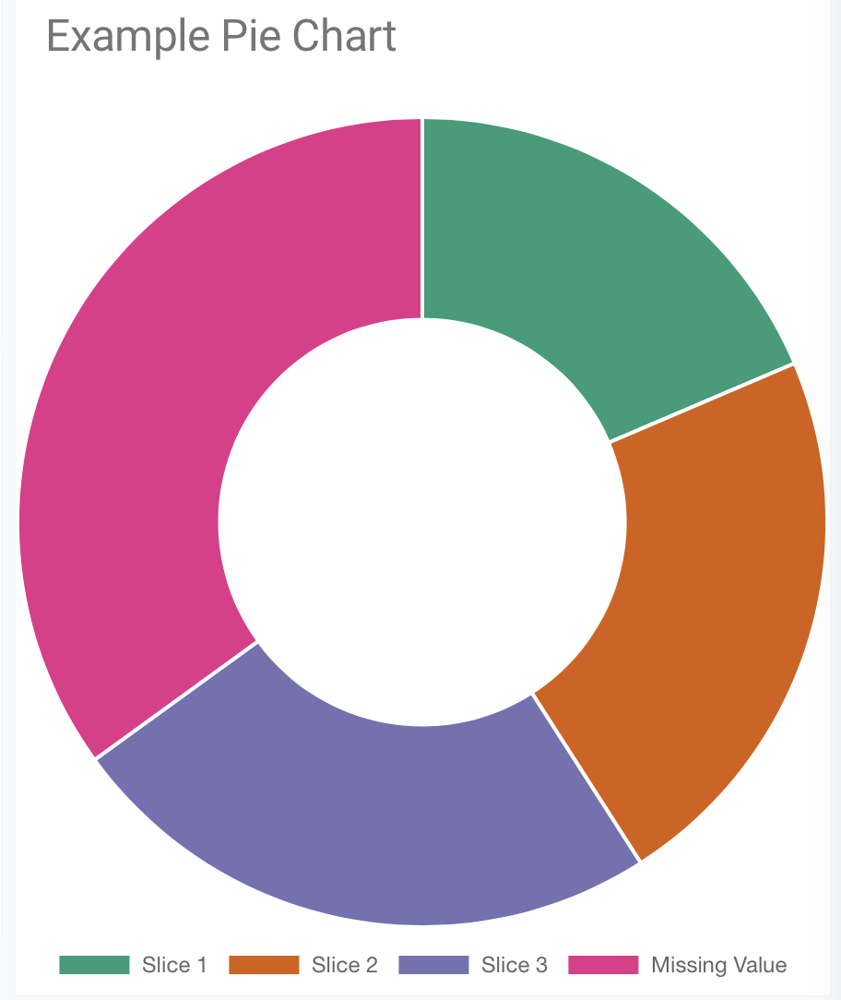
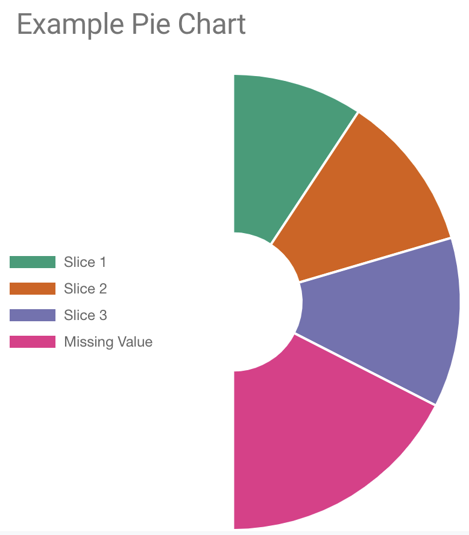

# Lovelace Pie Chart Card

This card will display a pie/doughnut chart based on your specified entities. This is a fork of https://github.com/sdelliot/pie-chart-card 


## Usage

Add this repo via HACS or 
download it manually and add to your lovalace yaml.
```yaml
- url: /local/pie-chart-card.js
  type: module
```

## Options

| Name              | Type         | Default           | Description
| ----------------- | ------------ | ----------------- | -----------
| type              | `string`     | **Required**      | `custom:pie-chart-card`
| entities          | `array`      | **Required**      | A list of [`Entity` objects](#entity-object).
| title             | `string`     | "Pie Chart"       | Title of the card.
| total_amount      | `string`     | none              | Either an entity or number which provides the total value for the pie chart. If provided, then other measured values will be substracted from total to calculate 'unknown' value.
| unknownText       | `string`     | none              | Optional customized unknown text. Only applicable with `total_amount` option enabled.
| cutout_percentage | `integer`    | 50                | Percentage of the inner should be cut out. 
| circumference     | `float`      |  6.28318  (2*PI)  | Circular coverage 
| rotation          | `float`      | -1.57079 (-.5*PI) | Starting angle to draw arcs from.
| legend            | `dictionary` |                   | Legend options |
| ├ show            | `boolean`    | `true`            | Legend visibility
| └ position        | `string`     | "bottom"          |  Choose between top,bottom,left,right |
| animation         | `dictionary` |                   | Animation options |
| ├ animate         | `boolean`    | `false`           | Animate in with a rotation animation |
| └ duration        | `integer`    | 0                 | The number of milliseconds an animation takes |


## `Entity` Object
| Name    | Type      | Default         | Description
| ------- | --------- | --------------- | -----------
| entity  | `string`  | **Required**    | The entity_id of the entity you want to show.                  |
| name    | `string`  | `friendly_name` | Name to use for entity. If this is not provided, then the entity `friendly_name` will be used. If the `friendly_name` does not exist, the actual entity_id will be used.                                       |

## Examples

### Default
```yaml
- type: "custom:pie-chart-card"
  title: "Example Pie Chart"
  entities:
    - entity: sensor.example_1
    - entity: sensor.example_2
    - entity: sensor.example_3
```

### Custom Slice Names
```yaml
- type: "custom:pie-chart-card"
  title: "Example Pie Chart"
  entities:
    - entity: sensor.example_1
      name: Slice 1
    - entity: sensor.example_2
      name: Slice 2
    - entity: sensor.example_3
      name: Slice 3
```

### Total Amount Using an Entity
```yaml
- type: "custom:pie-chart-card"
  title: "Example Pie Chart"
  total_amount: sensor.total_amount
  entities:
    - entity: sensor.example_1
    - entity: sensor.example_2
    - entity: sensor.example_3
```

### Total Amount Using a Number
```yaml
- type: "custom:pie-chart-card"
  title: "Example Pie Chart"
  total_amount: 10000
  entities:
    - entity: sensor.example_1
      name: Slice 1
    - entity: sensor.example_2
      name: Slice 4
    - entity: sensor.example_3
      name: Slice 3
```

### Custom Unknown Text
```yaml
- type: "custom:pie-chart-card"
  title: "Example Pie Chart"
  total_amount: 50000
  unknownText: "Missing Value"
  entities:
    - entity: sensor.example_1
      name: Slice 1
    - entity: sensor.example_2
      name: Slice 4
    - entity: sensor.example_3
      name: Slice 3
```



### All options
```yaml
- type: 'custom:pie-chart-card'
  title: "Example Pie Chart"
  total_amount: 50000
  unknownText: "Missing Value"
  entities:
    - entity: sensor.example_1
      name: Slice 1
    - entity: sensor.example_2
      name: Slice 4
    - entity: sensor.example_3
      name: Slice 3
  legend:
    show: true
    position: left
  cutout_percentage: 30
  circumference: 3.14159265359
  rotation: -1.57079632679
  animation:
    animate: true
    duration: 1000
```



